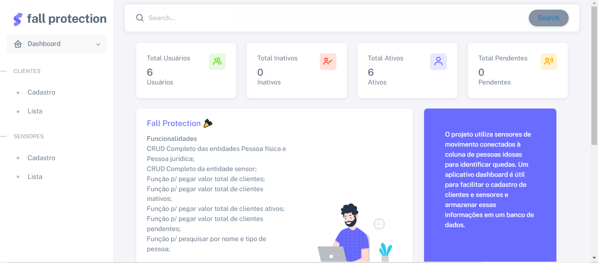

# Fall Protection
Projeto desenvolvido para a matéria de Enterprise Application Development



# Documentação do Projeto ASP.NET Core MVC com SQL Server

Esta é a documentação do projeto ASP.NET Core com SQL Server no formato MVC. Aqui você encontrará informações sobre a arquitetura do projeto, modelos de dados, rotas e controladores, configuração do banco de dados SQL Server e muito mais.

## Visão Geral

O projeto foi desenvolvido utilizando o ASP.NET Core, um framework de desenvolvimento web da Microsoft, juntamente com o banco de dados SQL Server. O padrão de arquitetura utilizado é o Model-View-Controller (MVC), que separa a lógica de negócios, a apresentação dos dados e as interações do usuário em diferentes componentes.

## Requisitos

- ASP.NET Core SDK
- SQL Server
- Visual Studio ou Visual Studio Code (opcional)

## Instalação

1. Clone o repositório do projeto: `git clone https://github.com/BrunaBGM/Fall_Protection.git`
2. Abra o projeto no Visual Studio ou Visual Studio Code.
3. Configure a conexão com o banco de dados SQL Server no arquivo `Program.cs`.
4. Execute as migrações para criar o esquema do banco de dados: `dotnet ef database update`.

## Arquitetura do Projeto

O projeto segue a estrutura básica do padrão MVC, com os seguintes diretórios principais:

- **Models**: Contém as classes de modelo que representam as entidades do banco de dados.
- **Views**: Contém os arquivos de visualização em formato HTML ou Razor.
- **Controllers**: Contém os controladores que lidam com as requisições HTTP e gerenciam as ações do usuário.
- **Data**: Contém as classes de contexto do banco de dados e as migrações.

## Configuração do Banco de Dados SQL Server

Para configurar a conexão com o banco de dados SQL Server, abra o arquivo `Program.cs` e atualize a string de conexão com as informações do seu servidor SQL Server.(Autenticação pelo Windows)
```
const connectionString = "Data Source=nome_do_servidor;Initial Catalog=nome_do_banco;Integrated Security=SSPI;TrustServerCertificate=True";
```
## Tecnologias

1. .NET 6
2. ASP.NET CORE
3. Entity Framework Core
4. Bootstrap 5
5. SQL Server
